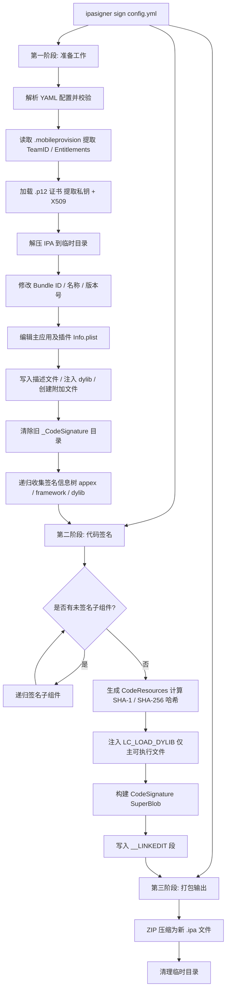
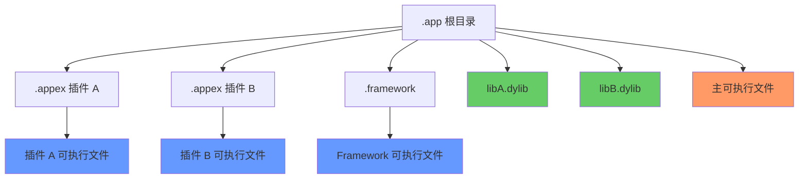

# ipasigner

iOS 平台 IPA 应用包重签名工具。使用 C++20 编写，支持通过 YAML 配置文件完成证书替换、描述文件替换、Bundle ID 修改、动态库注入、plist 编辑等完整的 IPA 重签名流程。

## 功能特性

- **IPA 重签名**：使用自签名证书或企业证书对 .ipa 文件进行完整重新签名
- **Bundle ID / 名称 / 版本修改**：支持修改 `CFBundleIdentifier`、`CFBundleDisplayName`、`CFBundleVersion` 等
- **动态库注入**：向 Mach-O 可执行文件注入 `.dylib`（支持强引用和弱注入）
- **描述文件处理**：自动提取 `.mobileprovision` 中的 Entitlements、Team ID 等信息
- **Plist 编辑**：灵活添加、删除、修改 Info.plist 中的键值对（支持嵌套路径）
- **多目标签名**：递归签名主应用及所有插件（`.appex`）、Framework（`.framework`）、动态库（`.dylib`）
- **Fat Binary 支持**：完整支持多架构（arm64/armv7 等）Fat Mach-O 文件签名
- **CodeResources 生成**：自动生成符合 Apple 规范的 CodeResources 资源校验文件
- **跨平台编译**：支持 Windows（MSVC）和 Linux（GCC）构建

## 实现原理

整个签名流程分为三个阶段：



### CodeSignature SuperBlob 结构


### 组件签名顺序



## 编译

### 环境要求

**Windows 构建：**

| 工具 | 版本 |
|:---:|:---|
| OS | Windows 10+ |
| C++ 标准 | ISO/IEC 14882:2020 (C++20) |
| CMake | >= 3.30 |
| MSVC | Visual Studio 2022 |
| Perl | Strawberry Perl >= 5.40 |
| Python | >= 3.13 |
| NASM | >= 3.0 |

**Linux 构建：**

| 工具 | 版本 |
|:---:|:---|
| OS | Debian 13 / Ubuntu 22.04+ |
| C++ 标准 | ISO/IEC 14882:2020 (C++20) |
| CMake | >= 3.30 |
| GCC/G++ | >= 14.0 |
| Perl | >= 5.40 |
| Python | >= 3.13 |

### 获取源码

```shell
wget -O ipasigner.zip https://gitee.com/ivfzhou/ipasigner/archive/master.zip
unzip ipasigner.zip
cd ipasigner
```

### 构建

```shell
cmake -S . -B ./build --fresh -DCMAKE_BUILD_TYPE=Release -DCMAKE_INSTALL_PREFIX=./install
cmake --build ./build --config Release --parallel --clean-first --target install
```

构建产物位于 `./install/bin/ipasigner`。

## 使用方法

### 查看帮助

```shell
./install/bin/ipasigner --help
```

### 执行签名

```shell
./install/bin/ipasigner sign ./config.yml
```

### 配置说明

编辑 `config.yml` 文件，配置签名所需参数：

```yaml
# ========== 必填项 ==========

# 待签名的 IPA 文件路径
ipaFilePath: /path/to/app.ipa
# 签名后输出的 IPA 文件路径
destinationIpaFilePath: /path/to/signed_app.ipa
# 签名证书文件路径（.p12 格式）
certificateFilePath: /path/to/certificate.p12
# 证书密码
certificatePassword: your_password
# 描述文件路径（.mobileprovision）
mobileProvisionFilePath: /path/to/embedded.mobileprovision

# ========== 选填项 ==========

# 动态库注入
dylibFilePath: /path/to/inject.dylib     # 要注入的 dylib 路径
weakInject: false                        # 是否弱注入（默认 false）

# Universal Link 与 Associated Domains
universalLinkDomains:
  - applinks:www.example.com
associatedDomains:
  - webcredentials:www.example.com

# 权限组配置
keychainGroups:
  - TEAMID.*
securityGroups:
  - group.com.example.app

# 多签：插件对应的子描述文件
appxProvisions:
  PluginName1: /path/to/plugin1.mobileprovision
  PluginName2: /path/to/plugin2.mobileprovision

# Bundle 信息修改
newBundleId: com.example.myApp           # 新 Bundle ID
newBundleName: MyApp                     # 新显示名称
newBundleVersion: 1                      # 新版本号

# Plist 键值对编辑
addPlistStringKey:
  WKCompanionAppBundleIdentifier: com.example.app
  NSExtension.NSExtensionAttributes.WKAppBundleIdentifier: com.example.app
removePlistStringKey:
  - SomeKeyToRemove

# 附加文件（写入到 .app 目录下）
additionalFileName: signature.lock
additionalFileData: abcd1234

# 选填，ipa 包压缩等级。默认为 6。范围 [0, 9]。
zipLevel: 6
```
